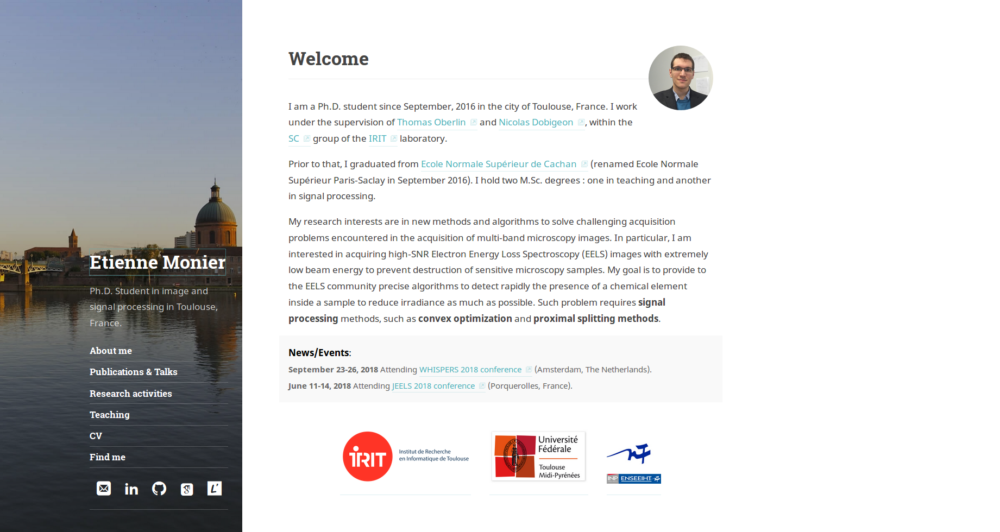

# Template for reaserchers professional Website

1. [Brief description](#description)
2. [Keypoints](#keypoints)
3. [Configuration and personalisation of this template](#configuration)
- [Global configuration](#global_configuration)
- [Changing the static pages text](#static-pages)
- [Setting the publication list](#publication_list)
- [Setting the server](#setting_server)
- [Make the website run](#website_run)
4. [Test material](#test_material)
5. [Author and License](#author_license)

A test can be found at [my webpage](http://monier.perso.enseeiht.fr/index.php).



## <a name="description"></a>Brief description

This is a template to create a professional website for reaserchers. 

I created it based on the jekyll [hydejack](https://github.com/qwtel/hydejack) theme. But the [Julien Flamant template](https://github.com/jflamant/jekyllTemplate) seems easyer if you want to use Jekyll (his template is inspired from the hydejack theme also).

On the contrary, my template requires some skills in HTML and, eventually, some other in php. It was a way for me to learn smart php programming. Its structure is Model/View/Controller. 

Conclusion: This theme is Ok if you want to play with php. You can also use it with html-only coding also, but you will have less flexibility (you could not add or remove a page, as an example).

## <a name="keypoints"></a>Keypoints

- **A php-based professional website**.
- Composed of 6 basic pages: Home/ About me, Publications, Reasearch activities, Teaching, CV and Find-me.
- The zones to modify for website personalization are well defined.
- A configuration file for the global behavior of the website.
- Handles social links (academic or not).
- The publications and talks lists are handles by a sqlite3 file (cf this section). 
- **Responsive website**.

## <a name="configuration"></a>Configuration and personalisation of this template

### <a name="global_configuration"></a>Global configuration

The global configuration of the website is defined in the `config/config.php` file. The three main sections are:
1. Site description: Title of the website, author, description, etc.
2. Icons and images: The website icons and images links.
3. Social: The social media definition.

All information about the modifications to give are described as comments in this file.

### <a name="static-pages"></a>Changing the static pages text

The website is composed of 6 pages which are described in the following table with appropriate file to modify.

Webpage | Description| File
--- | --- | ---
About me | Quick presentation with main skils. | `view/en/indexView.php`
Publications & Talks | A list of the publications and talks. | `view/en/publicationView.php`
Reasearch activities | A detailed description of your reaserch interests. | `view/en/reaserchView.php`
Teaching | A description of your teaching activity. |  `view/en/teachingView.php`
CV | CV | `view/en/curriculumView.php`
Find Me | Informations to contact you, your phone number, location. | `view/en/findmeView.php` 

Note: **The Publication & Talks content should not be modified. Please have a look to the next section for more explanations.**

Inside the associated files, the html section to modify is located beetween the `<?php ob_start(); ?>` and `<?php $content = ob_get_clean(); ?>` lines.

Take care to have a valid HTML code.

### <a name="publication_list"></a>Setting the publication list

The publication list is automaticly created based on the data stored in the central sqlite3 database. This file is located at `model/Publications.sqlite3`. To open and modify this file intuitively, I recomend you to use [DB Browser for SQLite](https://sqlitebrowser.org/) which is cross-plateform. 

Once the file is open, your can observe that 4 tables are created:
1. `InternationalConference` which gathers the International Conferences talks,
2. `InternationalJournal` which gathers the International Journal papers,
3. `NationalConference` which gathers the National Conferences talks,
4. `SubmittedInternationalJournal` which gathers the Submitted International Journal papers.

Each of these tables is composed of the following cells:
1. ID: this is an ID number which is auto-incremented. You should NOT inform this cell when creating a new entry.
2. IDtext: this is a small ID (whithout space) you should give when creating a new entry. This should be quite descriptive.
3. Citation: HTML-style citation of the paper.
4. Abstract (optional): Full abstract of the paper.
5. BibTex (optional): Full bibtex of the paper.
6. ArXiV (optional): ArXiV link of the paper.
7. Pdf (optional): relative link of the paper pdf (e.g. `/public/pdf/2017_icassp.pdf`).
8. Web (optional): web link to the paper.
9. Code (optional): relative link of the paper code (e.g. `/public/codes/2017_icassp.zip`).

DB Browser for SQLite is quite intuitive. Select the table and add/remove the entries. For the moment, be sure that the entries are ordered from the older to the most recent.

### <a name="setting_server"></a>Setting the server

The serer should have the right configuration to handle sqlite files with php.

1. Make sure that the sqlite driver for php is installed. On Linux, the package is `php-sqlite3`for php7 and `php5-sqlite3` for php5.
2. Configure php to use this driver by de-commenting the following lines
```
extension=php_pdo.dll
extension=php_pdo_sqlite3.dll
```
in the configuration file. The configuration file location can be found by using `php --ini | grep 'Loaded Configuration File'`in the Linux command.

### <a name="website_run"></a>Make the website run

Upload the files at your server internet root (classicaly /var/www/your-domain.fr). Go to your navigator and test your website.


## <a name="test_material"></a>Test material

The code has been developped and tested using php 7.0 on Ubuntu 16.04 LTS.

## <a name="author_license"></a>Author and License

Written by [Etienne Monier](http://monier.perso.enseeiht.fr/index.php).

This project is licensed under the terms of the MIT license.